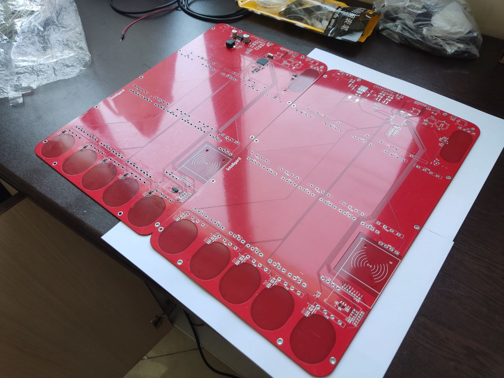

# Monitor Panel
This PCB was ordered by a client that wanted to show the status of a smart home system. The board has 10 RGB-backlight indicators and 5 input touch sensors. The board is controlled by an Atmega2560 microcontroller and communicates with other boards via the RS485 network.  

